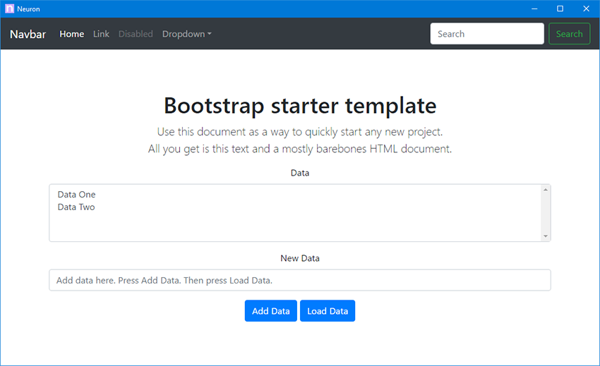

# Neuron

Neuron is a Python project that allows an application's GUI to be built with HTML and Javascript.  
It's simply a sample project that is ready to be downloaded and modified to become YOUR application.  
This project just combines different projects together with an installer.  

# CEF Python, wxPython, Flask

`wxPython` - Windowing  
`CEF Python` - Portable browser  
`Flask` - Local web server  
`Gevent` - Launches Flask  
`Bootstrap` - Web UI  
`xmlhttprequest` - Communication with Flask to update UI  

# How to Use

## Get Started

### Clone

Clone this repo

### Setup Environment

[Python 3.6](https://www.python.org/downloads/)  

`pip install -r requirements`

### Test Application

Start the application to make sure everything is working `python __main__.py`  
The application comes with a sample GUI with some interactions with the backend.  
The included HTML and Javascript functions are a sample of how actions can be performed.

## Understanding Structure

### \_\_main\_\_.py

Starts the application.  It is a `cefpython` (portable chrome browser) application, and the windowing system.  
It calls a function called `find_port()` which finds an open port on the local machine.  
It then calls the function `start_server()` which starts the Flask web server.

### start_gevent.py

This file is used to run `gevent` which handles running Flask and the incoming connections from your web gui.  
`start_gevent` is importing the Flask application from `app.py`

### app.py

This is the Flask application.  This is where routing for http calls will be, creating the HTML, and the backend of 
the application.  
This is where main part of the application is handled. 

### \_\_info\_\_.py

Fields that contain your application name and related information.

### \_\_init\_\_.py

Configures paths for the application.  
Contains functions for getting and creating paths for your application.  

### Templates directory

Contains the HTML files for the application

### Static directory

Contains the resources for the HTML files. Fonts, images, javascript libraries etc.

## Rebrand Project 

### Windowing and Icons

The top of \_\_main\_\_.py sets the size of the application.  
`icon.ico` is the icon used by the window.  

When creating an icon, you can bundle multiple sizes together to ensure it appears nicely at different sizes.  
You can download [icobundle](http://telegraphics.com.au/sw/product/ICOBundle) to combine the icons into one file.  
You can use this command. It also shows the different sizes you should create (eg icon24.ico is the 24x24 pixels size)  
`.\icobundl.exe -o icon.ico icon16.ico icon24.ico icon32.ico icon40.ico icon48.ico icon64.ico icon96.ico icon128.ico icon256.ico`

### Name, version etc

Modify `__info__.py`

## Modifying the Application

After rebranding the project, development on the new application can begin.

### Main Program Logic

`app.py` is the Flask application that controls the main logic of the application.  
Sample AJAX functions are included in the HTML to communicate with the backend Flask application.

### GUI

`Bootstrap` is used for the HTML.  This is not required, any HTML can be used.  
Modifying the files in the `templates` and `static` directories will allow you change the GUI.  
You call run `python app.py` and go to `localhost:5000` in your browser to work on your application without having 
to execute `__main__.py`.  
`templates/index.html` contains Javascript calls to the backend to retrieve data.

## Create Windows Executable and Installer

### PyInstaller and exe

An exe for the application is created with PyInstaller.  
`build/build.spec` is the PyInstaller spec which configures PyInstaller.  
Extra files and directories to include (eg icon.ico) are set in the spec file.  
To prevent the console window from appearing set `EXE(console=False)`.  

### NSIS installer

Install NSIS [http://nsis.sourceforge.net/Download](http://nsis.sourceforge.net/Download)  

The installer is created with nsis.  
`build/installer.nsi` is the template that will be automatically modified when creating a new build.  
Modify `build/icon.ico` and `build/header.bmp` for your application.  
Modify `build/license.txt` to be the contents of your application's license.  
Modify the fields at the top of `build/build.py`  

### Create new build

`$ cd build/`  
`$ python build.py`  

This will run pyinstaller to create the exe, copy it into `build/dist/`, and then create the installer with nsis.  
A file containing multiple hashes of the installer is also created.

# References

[CEFPython](https://github.com/cztomczak/cefpython) - Python bindings for the Chromium Embedded Framework  
[Flask](http://flask.pocoo.org/) - Python microframework  
[Bootstrap](http://getbootstrap.com/) - Web Front-End Framework  
[PyInstaller](http://www.pyinstaller.org/) - Turn Python projects into executables  
[NSIS](http://nsis.sourceforge.net/Main%5FPage) - Creates installer  

# Screenshot

# License

The license for this project is the MIT License